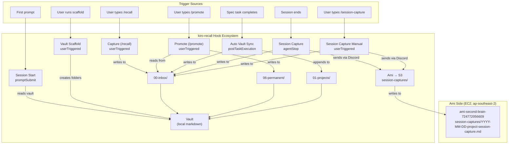
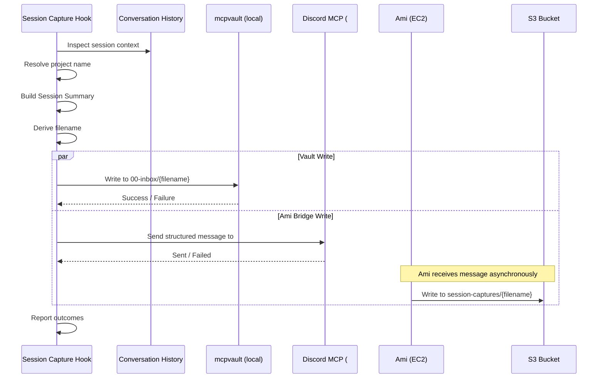

# Design: session-capture-bridge

## Overview

Session-capture-bridge adds two new hook files to kiro-recall that capture structured session summaries and write them to two independent destinations: the local Obsidian vault (via mcpvault) and Ami's S3 second brain bucket (via a structured Discord message to Ami). The two hooks share the same prompt logic but differ in trigger type:

- `kiro-recall-session-capture.kiro.hook` — fires on `agentStop` (automatic at session end)
- `kiro-recall-session-capture-manual.kiro.hook` — fires on `userTriggered` (invoked via `/session-capture`)

The deliverable is two JSON hook files in `.kiro/hooks/`. No Python code, no runtime changes, no compiled artifacts. The entire feature lives inside the `askAgent` prompt shared by both hooks, following the same conventions as the existing five kiro-recall hooks.

This is the first kiro-recall hook that writes to a destination outside the local vault. The Ami Bridge pattern sends a structured Discord message to the #ami channel. Ami (running on EC2 in ap-southeast-2) receives the message, parses the action request, and writes the content to `ami-second-brain-724772056609` under the `session-captures/` prefix. This avoids requiring local AWS CLI configuration or IAM credentials on Mike's machine.

The structured output format differs from the existing Capture Note format. Instead of "What happened" / "Why it matters", session captures use four fields: "What was built", "What was decided", "What was learned", and "Article candidate topics". The article candidate topics field feeds the content bullpen, satisfying Requirement 11 of the content-publish-pipeline spec.

---

## Architecture

### Artifacts

```
.kiro/hooks/kiro-recall-session-capture.kiro.hook
.kiro/hooks/kiro-recall-session-capture-manual.kiro.hook
```

Two JSON files. Both use the same prompt logic with one difference: the Session-type value is hardcoded per hook (`agentStop` or `userTriggered`). They also differ in `when.type` and `name`/`description`.

**agentStop hook:**
```json
{
  "name": "kiro-recall: Session Capture",
  "version": "1.0.0",
  "description": "Fires at session end. Reviews session context, generates a structured session summary, writes it to 00-inbox/ via mcpvault, and sends it to Ami via Discord for S3 storage.",
  "when": { "type": "agentStop" },
  "then": { "type": "askAgent", "prompt": "..." }
}
```

**userTriggered hook:**
```json
{
  "name": "kiro-recall: Session Capture (Manual)",
  "version": "1.0.0",
  "description": "Manually triggered session capture. Reviews session context, generates a structured session summary, writes it to 00-inbox/ via mcpvault, and sends it to Ami via Discord for S3 storage.",
  "when": { "type": "userTriggered" },
  "then": { "type": "askAgent", "prompt": "..." }
}
```

### Hook Ecosystem Diagram



### Data Flow



### Dependencies

- **mcpvault MCP server** — configured in `powers/kiro-recall/mcp.json`, provides read/write to the local vault
- **Discord MCP tool** — sends messages to the #ami Discord channel. The hook prompt instructs the agent to use whatever Discord/messaging MCP tool is available in the session. If no Discord tool is available, the Ami Bridge step is skipped with a warning.
- **Vault folders**: `00-inbox/` (write), `01-projects/` (read for project resolution)
- **Conversation history** — the agent inspects the current session's conversation to gather context

### Design Decision: Discord as Bridge

The hook sends a structured Discord message rather than calling AWS APIs directly. This is intentional:

1. No AWS CLI or IAM credentials needed on Mike's local machine
2. Ami already has IAM role access to the S3 bucket from EC2
3. Discord is already a configured communication channel for Ami
4. The message format is explicit enough for Ami to parse and act on without ambiguity
5. Failure in the Discord send is non-blocking — the vault write is the primary destination

### Design Decision: Near-Identical Prompts, Two Files

Both hooks use the same prompt logic with one intentional difference: the Session-type value is hardcoded in each hook's prompt to match its trigger type. The agentStop hook's prompt contains `agentStop` as the Session-type value; the userTriggered hook's prompt contains `userTriggered`. This is the only difference between the two prompts. All other logic, step structure, and wording are identical. If the prompt needs updating, both files get the same change except for the Session-type value.

---

## Components and Interfaces

### Component: Hook Files (x2)

Each hook file contains:

1. **Hook metadata** (name, version, description)
2. **Trigger configuration** (`agentStop` or `userTriggered`)
3. **Agent prompt** (identical in both files)

### Agent Prompt Steps

The prompt encodes a linear workflow. Each step has explicit success and failure paths.

| Step | Action | Reads | Writes |
|------|--------|-------|--------|
| Preamble | Check mcpvault availability | mcpvault probe | — |
| 1 | Gather session context | Conversation history, spec files | — |
| 2 | Resolve project name | Workspace path, `01-projects/`, open files, `.kiro/steering/` | — |
| 3 | Build Session Summary | — | — (in memory) |
| 4 | Derive filename | — | — |
| 5 | Write to vault | — | `00-inbox/{filename}` |
| 6 | Send to Ami via Discord | — | Discord message to #ami |
| 7 | Report outcomes | — | Chat output |

### Interface: Session Summary Format

```markdown
## Date
YYYY-MM-DD

## Project
{resolved project name}

## Session-type
{agentStop | userTriggered}

## What was built
{1-3 sentences describing concrete artifacts, features, or code}

## What was decided
{1-3 sentences describing design decisions, trade-offs, or direction changes}

## What was learned
{1-3 sentences describing new knowledge, insights, or patterns}

## Article candidate topics
- {concrete article angle grounded in session work}
- {another topic, if applicable}
```

### Interface: Vault Filename Format

```
YYYY-MM-DD-{project}-session-capture.md
```

Fixed suffix `session-capture` (not a task slug). One session capture per project per day, overwritten on repeat.

### Interface: Ami Bridge Message Format

The Discord message to #ami follows a structured format that Ami can parse unambiguously:

````
@ami session-capture-write

Target: s3://ami-second-brain-724772056609/session-captures/YYYY-MM-DD-{project}-session-capture.md

Content:
```md
{full Session Summary markdown}
```

Please write the content above to the specified S3 key. Overwrite if the key already exists.
````

Key elements:
- **Action line**: `@ami session-capture-write` — clear, parseable action identifier
- **Target line**: Full S3 URI with bucket and key
- **Content block**: Delimited by markdown code fences so Ami extracts the content without ambiguity
- **Instruction**: Explicit overwrite directive

### Interface: Project Name Resolution

Same logic as session-start and auto-vault-sync hooks:

| Priority | Signal | Source |
|----------|--------|--------|
| 1 | Primary | Workspace folder name vs `01-projects/` entries (case-insensitive) |
| 2 | Secondary | Open file paths, `.kiro/steering/` project field |
| 3 | Fallback | Hardcoded `unknown` |

Generic workspace names (`src`, `dev`, `project`, `app`, `code`, `workspace`, `repo`, `main`, `test`, `build`, `website`, `frontend`, `backend`, `api`, `server`, `client`, `lib`, `library`, `core`, `base`) skip the primary signal.

---

## Data Models

### Hook JSON Schema

```json
{
  "name": "string — hook display name",
  "version": "string — semver",
  "description": "string — one-line description",
  "when": {
    "type": "agentStop | userTriggered"
  },
  "then": {
    "type": "askAgent",
    "prompt": "string — the full agent prompt"
  }
}
```

### Session Summary Fields

| Field | Type | Source | Required |
|-------|------|--------|----------|
| Date | ISO 8601 date string | System clock | Yes |
| Project | String | Relevance detector output | Yes (defaults to `unknown`) |
| Session-type | Enum: `agentStop` or `userTriggered` | Hook trigger type | Yes |
| What was built | 1-3 sentences | Session context | Yes (use "Nothing notable this session." if empty) |
| What was decided | 1-3 sentences | Session context | Yes (use "Nothing notable this session." if empty) |
| What was learned | 1-3 sentences | Session context | Yes (use "Nothing notable this session." if empty) |
| Article candidate topics | Bulleted list, 1-3 items | Derived from session work | Yes (1-3 items when session has meaningful work) |

### Ami Bridge Message Fields

| Field | Type | Source |
|-------|------|--------|
| Action | Fixed string: `session-capture-write` | Hardcoded |
| Target S3 key | `session-captures/YYYY-MM-DD-{project}-session-capture.md` | Derived from date + project |
| Content | Full Session Summary markdown | Built in Step 3 |

### Relevance Detection Priority

| Priority | Signal | Source | Fallback |
|----------|--------|--------|----------|
| 1 | Primary | Workspace folder name vs `01-projects/` entries | Skip if generic name |
| 2 | Secondary | Open file paths, `.kiro/steering/` project field | — |
| 3 | Default | Hardcoded `unknown` | — |

### Generic Workspace Names (skip primary signal)

`src`, `dev`, `project`, `app`, `code`, `workspace`, `repo`, `main`, `test`, `build`, `website`, `frontend`, `backend`, `api`, `server`, `client`, `lib`, `library`, `core`, `base`


---

## Correctness Properties

*A property is a characteristic or behavior that should hold true across all valid executions of a system — essentially, a formal statement about what the system should do. Properties serve as the bridge between human-readable specifications and machine-verifiable correctness guarantees.*

### Property 1: Project resolution priority chain

*For any* workspace folder name and vault `01-projects/` listing, the relevance detector SHALL return the primary match (case-insensitive workspace name vs project entries) when one exists, fall back to secondary signal (open file paths, steering file project field) when primary fails, and return `unknown` when neither signal resolves. Generic workspace names (`src`, `dev`, `project`, `app`, `code`, `workspace`, `repo`, `main`, `test`, `build`, `website`, `frontend`, `backend`, `api`, `server`, `client`, `lib`, `library`, `core`, `base`) SHALL skip the primary signal entirely.

**Validates: Requirements 2.2, 9.4**

### Property 2: Session Summary structure compliance

*For any* generated Session Summary, the markdown content SHALL contain exactly seven `##` headings in this order: `## Date`, `## Project`, `## Session-type`, `## What was built`, `## What was decided`, `## What was learned`, `## Article candidate topics`. No headings may be omitted, reordered, or renamed.

**Validates: Requirements 3.1, 3.7, 10.1, 10.2, 10.3**

### Property 3: Narrative field sentence count

*For any* generated Session Summary, each of the three narrative fields ("What was built", "What was decided", "What was learned") SHALL contain between 1 and 3 sentences. When a field has no relevant session content, it SHALL contain exactly the placeholder text "Nothing notable this session." (which counts as 1 sentence).

**Validates: Requirements 3.2, 3.3, 3.4, 3.6**

### Property 4: Article candidate topics format

*For any* generated Session Summary where the session contains meaningful work, the "Article candidate topics" field SHALL contain a markdown bulleted list of 1 to 3 items, where each item is a line starting with `- `. Zero items is not permitted when meaningful work occurred.

**Validates: Requirements 3.5, 7.4, 10.4**

### Property 5: Vault filename format compliance

*For any* date and project name, the generated vault filename SHALL match the pattern `YYYY-MM-DD-{project}-session-capture.md` where `YYYY-MM-DD` is a valid ISO 8601 date and `{project}` is the resolved project name.

**Validates: Requirements 4.2**

### Property 6: Ami Bridge message format compliance

*For any* Session Summary and metadata (date, project name), the Ami Bridge Discord message SHALL contain: (a) a clear action identifier (`session-capture-write`), (b) the target S3 key in the format `session-captures/YYYY-MM-DD-{project}-session-capture.md`, and (c) the full Session Summary content delimited by markdown code fences.

**Validates: Requirements 5.2, 5.3**

### Property 7: Write failure preserves content

*For any* scenario where all write destinations fail (both vault write and Ami Bridge), the full Session Summary content SHALL appear in the agent's chat output inside a markdown code block so no captured knowledge is lost. When at least one destination succeeds, no code block is needed.

**Validates: Requirements 4.4, 4.5, 6.4, 8.3**

### Property 8: No internal details in error output

*For any* failure scenario (MCP unavailable, vault write failure, Discord send failure), the agent output SHALL NOT contain stack trace patterns, exception class names, or absolute file system paths.

**Validates: Requirements 8.1, 8.5**

---

## Error Handling

### Error Scenarios and Responses

| Failure Point | Agent Output | Vault Write | Ami Bridge | Continues? |
|---|---|---|---|---|
| mcpvault unavailable at preamble | Warm warning, vault skipped | Skipped | Attempted | Yes |
| Session has no meaningful work | "Nothing substantial to capture from this session." | Skipped | Skipped | Yes (exit) |
| `01-projects/` listing fails | Use `unknown` as project name | Attempted | Attempted | Yes |
| Vault write to `00-inbox/` fails | Summary in code block only if Ami Bridge also fails; otherwise short warning | Failed | Attempted | Yes |
| Discord MCP tool unavailable | Short warning, Ami Bridge skipped | Unaffected | Skipped | Yes |
| Discord message send fails | Short warning | Unaffected | Failed | Yes |
| Both vault and Ami Bridge fail | Summary displayed in code block (last resort, no destination succeeded) | Failed | Failed | Yes |
| mcpvault unavailable AND Ami Bridge fails | Summary displayed in code block (no destination succeeded) | Skipped | Failed | Yes |

### Error Handling Principles

1. **Never lose content.** If all write destinations fail, the generated Session Summary is displayed in chat so Mike can save it manually. This is the non-negotiable guarantee.
2. **Never block session completion.** The hook fires after session work is done (`agentStop`) or on demand (`userTriggered`). All failures are informational, not blocking.
3. **Never surface internals.** No stack traces, exception class names, or absolute file paths in any output. Warm, conversational messages only.
4. **Independent failure domains.** The vault write and Ami Bridge write are separate operations with separate error handling. A failure in one does not prevent, roll back, or affect the other.
5. **No retries.** If an MCP call fails, the hook reports the failure and moves on. Retries risk confusing the agent or duplicating work.
6. **Degrade gracefully.** If mcpvault is unavailable, the hook still attempts the Ami Bridge write. If Discord is unavailable, the vault write is unaffected.

### Failure Combination Matrix

| Vault | Ami Bridge | Outcome |
|-------|-----------|---------|
| Success | Success | Both confirmed, short success message |
| Success | Failure | Vault confirmed, Ami Bridge warning (non-blocking) |
| Failure | Success | Vault warning (non-blocking), Ami Bridge confirmed. No code block needed — summary reached S3 |
| Failure | Failure | Summary in code block (no destination succeeded), both failures noted |
| Skipped (MCP unavailable) | Success | Vault skip warning, Ami Bridge confirmed. No code block needed — summary reached S3 |
| Skipped (MCP unavailable) | Failure | Summary in code block (no destination succeeded), vault skip + Ami Bridge failure noted |

---

## Testing Strategy

### Approach

This feature produces two JSON hook files with no compiled code. Testing is split into two categories:

1. **Structural validation** of the hook JSON files
2. **Behavioral validation** of the extractable logic (project resolution, filename derivation, summary structure, Ami Bridge message format) via property-based testing

### Property-Based Testing

**Library:** fast-check (JavaScript/TypeScript)

Each correctness property from the design maps to a single property-based test. Tests generate random inputs and verify the property holds across at least 100 iterations.

**Tag format:** `Feature: session-capture-bridge, Property {N}: {property title}`

| Property | Test Strategy | Generator |
|---|---|---|
| P1: Project resolution priority chain | Generate random workspace names and `01-projects/` listings. Verify the resolver returns the correct priority match. Include generic names to verify primary signal bypass. | Random strings for workspace names, random file listings, picks from generic names list |
| P2: Session Summary structure compliance | Generate random session context (built/decided/learned content, article topics). Build a summary and verify it contains exactly the seven required `##` headings in order. | Random sentences for each field, random project names, random dates |
| P3: Narrative field sentence count | Generate random narrative content for each of the three fields (including empty content). Verify each field has 1-3 sentences, with empty fields using the placeholder text. | Random sentence generators with 0-5 sentences, empty string edge case |
| P4: Article candidate topics format | Generate random article topic lists. Verify the field contains 1-3 bullet items starting with `- `. | Random topic strings, lists of 1-5 items |
| P5: Vault filename format compliance | Generate random dates and project names. Verify the filename matches `YYYY-MM-DD-{project}-session-capture.md`. | Random ISO dates, random alphanumeric project names |
| P6: Ami Bridge message format compliance | Generate random summaries and metadata. Verify the Discord message contains the action identifier, S3 key, and code-fenced content. | Random summary markdown, random dates and project names |
| P7: Write failure preserves content | Generate random summary content, simulate write failures, verify the content appears verbatim in the output. | Random markdown content |
| P8: No internal details in error output | Generate random error messages with injected stack traces and file paths. Verify the output contains none of these patterns. | Random error strings with injected Java/Python/JS stack traces and absolute paths |

### Unit Tests

Unit tests cover specific examples and edge cases that complement the property tests:

- Both hook JSON files parse as valid JSON
- agentStop hook has `when.type` of `agentStop`, manual hook has `userTriggered`
- Both hooks have `then.type` of `askAgent`
- Both hooks share near-identical prompt text (only Session-type value differs)
- Hook filenames match the naming convention
- Prompt contains `## Step` sections matching the existing hook format
- Prompt contains the preamble mcpvault availability check
- Empty session produces "Nothing substantial to capture from this session."
- Workspace name `src` skips primary signal
- Project name defaults to `unknown` when no signals match
- Session-type field reflects the trigger type (`agentStop` vs `userTriggered`)
- Ami Bridge message contains `session-capture-write` action identifier
- Vault write failure displays summary in markdown code block only when Ami Bridge also fails
- Discord failure does not affect vault write outcome
- Both writes failing displays summary in code block (last resort)

### Test Configuration

- Property tests: minimum 100 iterations per property
- Each property test tagged with: `Feature: session-capture-bridge, Property {N}: {property title}`
- Each correctness property implemented by a single property-based test
- fast-check as the PBT library
